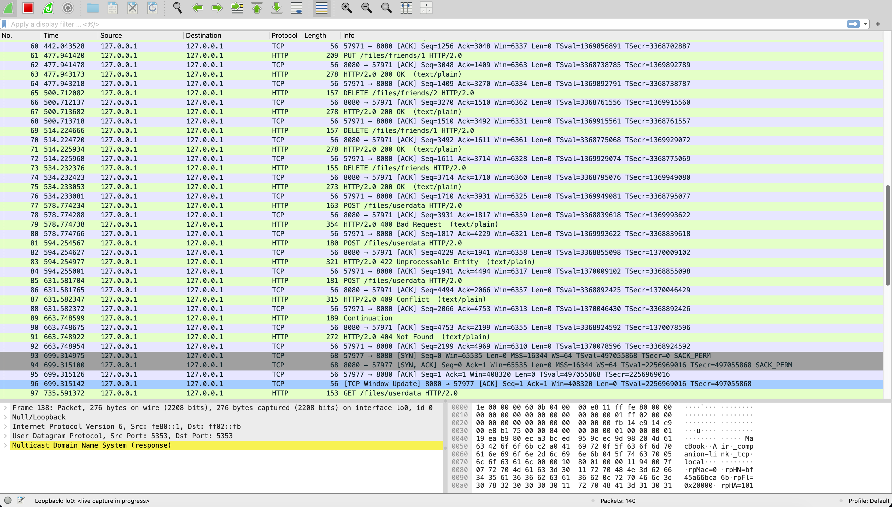
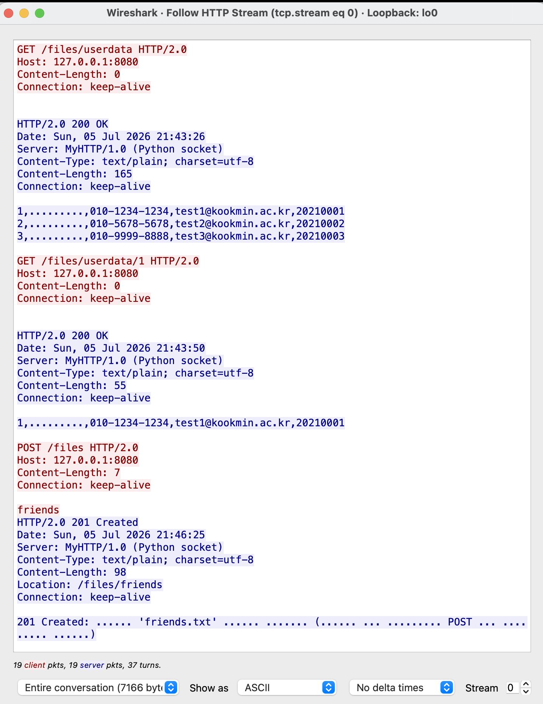

# 컴퓨터 네트워크 여름 계절학기 과제입니다.

> **선택1(구현) — TCP 소켓 기반 HTTP/2.0 사용자 관리 서버·클라이언트 (다중 클라이언트 버전)**
> 소프트웨어학부 20233032 김주한 (2학년)
> 언어: Python 3 (표준 라이브러리만 사용, 외부 패키지 설치 불필요)

이 문서는 과제의 **설계·구현·동작·개발 이력**을 코드 주석까지 곁들여 상세히 설명한 README입니다.
웹 프레임워크(Flask·Django 등) 없이 Python `socket` 만으로 **TCP 위에 HTTP 프로토콜을 직접 구현**했고,
서버 백엔드는 **실제 파일을 데이터베이스처럼 다뤄** 사용자 정보를 CRUD 합니다.

> **시연 영상 (YouTube)**: [영상 보기](https://www.youtube.com/watch?v=k_cYw6NMXT8)
> 
> **GitHub 저장소**: https://github.com/J-JIM/base-client-server

---

## 목차

1. [과제 개요](#1-과제-개요)
2. [개발 이력 (기능 추가란)](#2-개발-이력-기능-추가란)
3. [폴더 구조](#3-폴더-구조)
4. [실행 방법](#4-실행-방법)
5. [전체 동작 원리](#5-전체-동작-원리)
6. [데이터 저장 방식](#6-데이터-저장-방식)
7. [HTTP 메시지를 직접 만든다는 것](#7-http-메시지를-직접-만든다는-것)
8. [소스 코드 상세 설명 (주석 포함)](#8-소스-코드-상세-설명-주석-포함)
9. [API 명세](#9-api-명세)
10. [HTTP 상태코드 10종](#10-http-상태코드-10종)
11. [동시 클라이언트 & 파일 안전 (스레드 + Lock)](#11-동시-클라이언트--파일-안전-스레드--lock)
12. [클라이언트 명령어](#12-클라이언트-명령어)
13. [검증 · 테스트](#13-검증--테스트)
14. [Wireshark 패킷 분석](#14-wireshark-패킷-분석)
    - [14-1. Wireshark 실제 캡처 화면 (스크린샷)](#14-1-wireshark-실제-캡처-화면-스크린샷)
15. [트러블슈팅](#15-트러블슈팅)
16. [부록 — 상태코드 결정 흐름](#16-부록--상태코드-결정-흐름)
17. [시연 방식 & 주의사항 (녹화 가이드)](#17-시연-방식--주의사항-녹화-가이드)
18. [부록 — 링크 (영상·저장소)](#18-부록--링크)

---

## 1. 과제 개요

### 1.1 무엇을 만들었나
- **클라이언트–서버(Client–Server) 구조**의 프로그램입니다. 서버를 먼저 실행해 두고, 클라이언트가 접속해 명령을 보냅니다.
- **프로토콜**: HTTP/2.0(TCP 기반). 요청라인·헤더·바디를 **문자열로 직접 만들고 직접 파싱**합니다.
  - ※ 실제 HTTP/2의 바이너리 프레이밍이 아니라, **버전 문자열을 `HTTP/2.0`으로 표기**한 텍스트 기반 구현입니다.
- **백엔드**: 요청을 받으면 단순히 `200 OK`만 돌려주는 "노액션"이 아니라, 메서드에 맞춰 **실제 파일을 조회·생성·수정·삭제**합니다.
- **데이터**: 사용자 정보를 한 줄 = 한 명으로 저장합니다 → **`id,이름,전화,이메일,학번`**.
- **연결**: 지속 연결(persistent / keep-alive). 한 클라이언트와 연결을 유지하며 여러 요청을 처리하고, 클라이언트가 연결을 닫으면 종료를 감지합니다.
- **다중 클라이언트**: 연결마다 **스레드**를 띄워 여러 클라이언트를 **동시에** 처리하고, 동시 접근으로 파일이 깨지지 않게 **Lock**으로 보호합니다.

### 1.2 선택1(구현) 제출 요건과의 대응
| 요건 | 과제  수행 방식 |
|------|-------------|
| 소스 파일 | `src/server.py`, `src/client.py` |
| README(개요·환경·기능·실행법) | 본 문서 |
| 시연 영상(5분↑) | 12장(명령어)·13장(테스트)·14장(Wireshark) 흐름대로 시연 |
| Wireshark 캡처 | `lo0` / `tcp.port == 8080` |
| 5개 이상 메서드–응답 케이스 | GET·POST·PUT·DELETE + 400·404·405·409·422·505 등 10종 |

### 1.3 사용한 HTTP 상태 코드 (총 10종)
서버는 요청 처리 결과를 **10가지 HTTP 상태 코드**로 구분해 응답합니다. 각 코드가 무슨 뜻이고, 이 과제에서 언제 쓰는지는 다음과 같습니다.

- **200 OK** — "요청 성공". 조회·수정·삭제가 정상 처리됐을 때.
- **201 Created** — "새 자원이 생성됨". 새 파일을 만들거나(파일 CREATE) 데이터를 추가(레코드 CREATE)했을 때. 응답에 만들어진 위치를 `Location` 헤더로 함께 알려줍니다.
- **400 Bad Request** — "요청 형식이 잘못됨". 바디의 필드 수가 안 맞거나 비었을 때, 파일 이름 규칙(영문/숫자/한글/_/- 1~32자)을 어겼을 때.
- **404 Not Found** — "요청한 것이 없음". 없는 id, 없는 파일, 알 수 없는 경로.
- **405 Method Not Allowed** — "그 경로에서 지원하지 않는 메서드". 예: `/files`에 PUT 요청. 가능한 메서드를 `Allow` 헤더로 안내합니다. (기본 파일 `userdata` 삭제 시도도 여기에 해당)
- **409 Conflict** — "중복 충돌". 이미 등록된 학번·이메일로 추가·수정하려 하거나, 이미 있는 이름으로 파일을 만들려 할 때.
- **411 Length Required** — "길이 헤더 필요". POST/PUT 요청인데 `Content-Length` 헤더가 없을 때.
- **422 Unprocessable Entity** — "값이 이상함". 구조(필드 수)는 맞지만 학번이 숫자가 아니거나, 이메일에 `@`·`.`가 없는 등 값 형식이 틀렸을 때.
- **500 Internal Server Error** — "서버 내부 오류". 요청을 처리하다 예기치 못한 예외가 났을 때(방어용).
- **505 HTTP Version Not Supported** — "지원하지 않는 HTTP 버전". `HTTP/1.0·1.1·2.0` 이외의 버전으로 요청했을 때.

> 과제 요건은 **최소 5종**이지만, 본 과제는 **10종을 모두** 처리합니다. 각 코드가 정확히 어떤 조건에서 나오는지와 판정 순서는 [10장](#10-http-상태코드-10종)·[16장](#16-부록--상태코드-결정-흐름)에 자세히 정리했습니다.

---

## 2. 개발 이력 (기능 추가란)

과제는 아래 순서로 **단계적으로** 기능을 쌓아 올렸습니다.

| 버전 | 날짜 | 카테고리 | 핵심 내용 |
|------|------|----------|-----------|
| v1.0 | (초기) | 기본 구현 | TCP 소켓 + HTTP/2.0 직접 구현, 단일 파일(userdata.txt) 사용자 CRUD, 상태코드 10종, 지속 연결 |
| **v1.1** | **6/28** | **기능 추가 — CRUD를 이용한 파일·데이터 생성/삭제** | **파일 자체의 생성/삭제 + 파일 안 데이터의 생성/삭제** 구현 |
| **v1.2** | **7/4** | **동시 클라이언트 + 파일 안전** | **스레드 기반 다중 클라이언트 + threading.Lock 파일 보호** |

### 2.1 v1.0 — 기본 구현 (초기)
- `socket`으로 TCP 서버/클라이언트를 만들고, 그 위에 HTTP 요청/응답 문자열을 직접 다뤘습니다.
- 하나의 파일 `userdata.txt`를 간이 DB로 두고, `/users` 경로에 대해 GET·POST·PUT·DELETE를 처리했습니다.
- 상태코드 10종(200·201·400·404·405·409·411·422·500·505)과 지속 연결을 구현했습니다.

### 2.2 v1.1 (6/28) — 기능 추가: CRUD를 이용한 파일·데이터 생성/삭제 (핵심)
> **동기**: CREATE를 한 가지 방식으로만 하지 않고, **'기존 파일에 데이터를 생성'** 과 **'새 파일을 만들어 생성'** 두 방식을 모두 지원해 유연성을 높이기 위함입니다.

CRUD의 **CREATE·DELETE 를 "레코드(데이터)"뿐 아니라 "파일"에도** 적용했습니다.

**(a) 파일 단위 — 파일 생성/삭제**
- `POST /files` (body=파일이름) → **새 데이터 파일 생성** (CREATE)
- `DELETE /files/{f}` → **파일 통째 삭제** (DELETE)
- `GET /files` → 데이터 파일 목록(+인원수)

**(b) 레코드 단위 — 파일 안 데이터 생성/삭제**
- `POST /files/{f}` (body=레코드) → **선택한 파일 안에 데이터 추가** (CREATE)
- `DELETE /files/{f}/{id}` → **선택한 파일 안 데이터 삭제** (DELETE)
- `GET /files/{f}` · `GET /files/{f}/{id}` · `PUT /files/{f}/{id}` → 조회·수정

즉 **CREATE는 두 갈래**가 됩니다: `NEWFILE`(새 파일을 만들어 데이터 생성) / `POST`(기존 파일에 데이터 생성).
**UPDATE**는 "데이터가 만들어진 파일을 골라서(`USE`) 그 안의 레코드를 수정"하는 방식입니다.

이를 위해 저장 계층을 **2계층**으로 나눴습니다.
- `FileManager` : 여러 데이터 파일을 관리(파일 목록/생성/삭제, 파일 이름 검사).
- `RecordStore` : 파일 **하나**의 레코드를 CRUD(추가/조회/수정/삭제).

또한 기존 `/users`·`/users/{id}` 경로는 **그대로 동작**하도록 남겨(내부적으로 `/files/userdata`로 라우팅) 이전에 만든 Wireshark 캡처·시연이 깨지지 않게 했습니다.

클라이언트에는 파일 관리 명령 `FILES` / `NEWFILE` / `DELFILE` / `USE`를 추가했습니다.

### 2.3 v1.2 (7/4) — 동시 클라이언트 + 파일 안전 (핵심)
> **동기**: 기존 서버는 한 클라이언트를 끝까지 처리해야 다음 클라이언트를 받는 **iterative 서버**였습니다. 실제 서버처럼 **여러 클라이언트를 동시에** 받으려면 연결마다 별도 처리가 필요합니다.

**(a) 동시 클라이언트 — 스레드**
- `accept()`로 받은 연결을 그 자리에서 처리하지 않고 **새 스레드에 맡긴 뒤 곧바로 다음 `accept()`** 로 돌아갑니다 → 여러 클라이언트를 **동시에 서비스**(concurrent server).

**(b) 파일 안전 — threading.Lock**
- 스레드가 여러 개면 같은 데이터 파일에 **동시에 쓰다가 내용이 깨질 수 있습니다.**
- 그래서 파일을 실제로 읽고/쓰는 구간(`route()`)을 **`threading.Lock`으로 감싸** "한 번에 한 스레드만" 들어가게 했습니다(임계 구역, critical section).

**(c) 폴더 구조 정리(실무형)**
- 소스는 `src/`, 데이터 파일은 이웃한 `data/` 폴더에 쌓이도록 분리했습니다.

> **중요**: v1.2의 스레드·Lock은 "연결을 어떻게 받고 안전하게 처리하느냐"만 바꿉니다. **v1.1에서 만든 CRUD(파일 생성/삭제·데이터 생성/삭제·조회·수정)·상태코드·`/users` 호환은 100% 그대로 보존**됩니다.

---

## 3. 폴더 구조

```
컴네_과제_다중/
├── README.md            # 본 문서
├── src/                 # 소스 코드
│   ├── server.py        # HTTP 서버 (소켓 + 스레드 + Lock + 파일/레코드 CRUD)
│   └── client.py        # 대화형 클라이언트 (친근한 명령 → HTTP 요청)
└── data/                # 데이터 파일이 쌓이는 곳 (*.txt)
    └── userdata.txt     # 기본 데이터 파일 (없으면 서버가 시드 3명 자동 생성)
```

- **소스(`src/`)와 데이터(`data/`)를 분리** — 코드와 저장소를 섞지 않는 실무 관습입니다.
- 서버는 `src/server.py`의 위치를 기준으로 **항상 이웃한 `data/`** 를 데이터 폴더로 씁니다(어느 위치에서 실행하든 동일).
- `NEWFILE <이름>`으로 만든 파일도 전부 `data/` 안에 `<이름>.txt`로 생깁니다.
- 파일 이름은 **영문/숫자/한글/`_`/`-` 1~32자**만 허용합니다(`../` 같은 경로 조작 차단).

---

## 4. 실행 방법

Python 3만 있으면 됩니다(설치할 패키지 없음). 터미널 두 개(또는 그 이상)를 씁니다.

```bash
cd 컴네_과제_다중

# 터미널 A — 서버
python3 src/server.py
```
출력 예:
```
[서버 시작] HTTP/2.0  http://127.0.0.1:8080  (다중 클라이언트: 스레드)
[데이터 폴더] .../컴네_과제_다중/data  (파일 = *.txt)
[종료] Ctrl + C
```
```bash
# 터미널 B, C ... — 클라이언트 (동시에 여러 개 띄워도 됨)
python3 src/client.py
```

- 서버 종료는 **Ctrl + C** (서버는 `accept()`로 네트워크만 기다려 키보드 "exit"는 받지 않음 — 정상).
- 클라이언트 종료는 `quit` / `exit` 또는 Ctrl + C.
- **(대안) curl로도 테스트 가능**:
  ```bash
  curl -v http://127.0.0.1:8080/files
  curl -v -X POST --data "friends" http://127.0.0.1:8080/files
  curl -v -X POST --data "박철,010-1,a@b.com,20210004" http://127.0.0.1:8080/files/friends
  ```

---

## 5. 전체 동작 원리

### 5.1 큰 그림
```
[클라이언트]                         [서버]
 사용자 입력                          ┌───────────────────────────────┐
 "POST 박철,010-...,20210004"         │ 환영 소켓(:8080, listen)       │
      │ build_request()               │   accept() ──┐                 │
      ▼                               │              ▼ (연결마다 스레드)│
 HTTP 요청 문자열  ── TCP ──→  recv_http_message() → parse → route() → handler
                                      │        │                        │
                                      │        ▼ (Lock)                 │
                                      │   FileManager / RecordStore ──→ data/*.txt
                                      │        │                        │
      ←── HTTP 응답 문자열 ── TCP ──  make_response()                    │
      ▼                               └───────────────────────────────┘
 응답 출력
```

### 5.2 한 번의 요청 처리 순서(서버)
1. `accept()` — 클라이언트 연결 수락(3-way handshake 완료). **연결마다 새 스레드**를 띄운다.
2. `recv_http_message()` — TCP 바이트 스트림에서 **HTTP 메시지 1개**를 잘라 읽는다.
3. `parse_message()` — 요청라인(메서드·경로·버전)·헤더·바디로 분리.
4. 버전 검사(→505), Content-Length 검사(→411).
5. **`with self.lock:`** 안에서 `route()` — 경로/메서드에 맞는 핸들러 호출 → 파일 조작.
6. `make_response()` — 상태라인·헤더·바디를 HTTP 형식으로 조립해 전송.
7. 지속 연결이므로 다시 2번으로(같은 연결에서 다음 요청 처리). 클라이언트가 닫으면 종료.

---

## 6. 데이터 저장 방식

### 6.1 한 파일 = 하나의 사용자 목록(테이블)
- 데이터 파일은 `data/` 안의 `*.txt`입니다. `userdata`가 기본이고, `NEWFILE`로 `friends`, `classA` 같은 파일을 더 만들 수 있습니다.
- 한 줄 = 한 사용자, 콤마로 5개 필드 구분: **`id,이름,전화,이메일,학번`**.
```
1,홍길동,010-1234-1234,test1@kookmin.ac.kr,20210001
2,김철수,010-5678-5678,test2@kookmin.ac.kr,20210002
3,이영희,010-9999-8888,test3@kookmin.ac.kr,20210003
```
- **`id`는 서버가 자동 부여**(POST 시 그 파일의 최대 id + 1). id는 **파일마다 독립적**으로 매겨집니다.
- **파일에는 바디 데이터(이름·전화·이메일·학번)만 저장**합니다. IP·상태코드·HTTP 헤더는 통신용이라 저장하지 않습니다.

---

## 7. HTTP 메시지를 직접 만든다는 것

프레임워크가 없으니 요청/응답의 **문자열 형식을 직접** 만들고 파싱합니다.

**요청(Request) — 클라이언트가 보냄**
```
POST /files/userdata HTTP/2.0     ← 요청라인: [메서드] [경로] [버전]
Host: 127.0.0.1:8080              ← 헤더
Content-Length: 40                ← 바디 바이트 수
Connection: keep-alive
                                  ← 빈 줄(\r\n\r\n = 헤더 끝)
박철,010-1111-2222,park@kookmin.ac.kr,20210004   ← 바디(POST/PUT만)
```
**응답(Response) — 서버가 보냄**
```
HTTP/2.0 201 Created              ← 상태라인: [버전] [상태코드] [사유구]
Date: Sat, 05 Jul 2026 10:53:55
Server: MyHTTP/1.0 (Python socket)
Content-Type: text/plain; charset=utf-8
Content-Length: 33
Location: /files/userdata/4       ← 생성된 자원 위치(201일 때)
Connection: keep-alive
                                  ← 빈 줄
201 Created: 파일 'userdata' 에 id=4 추가 완료.   ← 바디
```
> TCP는 바이트 스트림이라 한 번에 다 오지 않을 수 있습니다. 그래서 서버는 `\r\n\r\n`(헤더 끝)까지 먼저 모으고, `Content-Length`만큼 바디를 마저 읽어 **메시지 경계**를 맞춥니다(8.2 참고).

---

## 8. 소스 코드 상세 설명 (주석 포함)

아래는 실제 코드와 **거기 달아 둔 주석**을 함께 보여주며 기능을 설명합니다.

### 8.1 상수 · 설정
```python
HOST = "127.0.0.1"
PORT = 8080
HTTP_VERSION = "HTTP/2.0"
ACCEPTED_VERSIONS = ("HTTP/1.0", "HTTP/1.1", "HTTP/2.0")   # 이 외 버전은 505로 거절

# 데이터 폴더 = 이 스크립트(src/server.py)의 '한 단계 위'에 있는 data/ 폴더.
# (어느 위치에서 실행하든 항상 프로젝트의 data/ 를 가리키도록 __file__ 기준으로 계산)
DATA_DIR = os.path.normpath(os.path.join(os.path.dirname(os.path.abspath(__file__)), "..", "data"))
DATA_EXT = ".txt"
DEFAULT_FILE = "userdata"
FIELDS = ("id", "name", "phone", "email", "studentid")

# 파일 이름 규칙: 영문/숫자/한글/밑줄/하이픈 1~32자.
# ('/', '..', '.' 등을 막아 데이터 폴더 밖으로 나가는 '경로 조작(path traversal)'을 차단)
FILENAME_RE = re.compile(r"^[A-Za-z0-9_가-힣\-]{1,32}$")
```
- `DATA_DIR`을 `__file__` 기준으로 계산하므로, **어느 폴더에서 실행하든** 항상 프로젝트의 `data/`를 씁니다.
- `FILENAME_RE`는 **보안 장치**입니다. 사용자가 `../../etc/passwd` 같은 이름을 넣어도 정규식에 안 맞아 거부됩니다.

### 8.2 메시지 경계 처리 — `recv_http_message()`
TCP는 "바이트 스트림"이라 `recv()` 한 번에 요청 하나가 딱 떨어지지 않습니다. 그래서 **헤더 끝(`\r\n\r\n`)** 을 찾고, **`Content-Length`만큼** 바디를 더 읽어 메시지를 1개 단위로 잘라냅니다.
```python
def recv_http_message(sock, buffer):
    """소켓에서 HTTP 메시지 1개(헤더+바디)를 읽어 (메시지bytes, 남은buffer) 반환.
    상대가 연결을 닫으면 (None, b'') 를 돌려준다. (지속 연결의 메시지 경계 처리)"""
    # 1) 헤더 끝(\r\n\r\n) 까지 모은다
    while b"\r\n\r\n" not in buffer:
        chunk = sock.recv(4096)
        if not chunk:                 # 상대가 연결을 닫음
            return None, b""
        buffer += chunk
    header_bytes, _, rest = buffer.partition(b"\r\n\r\n")
    # 2) Content-Length 만큼 바디를 더 받는다
    content_length = 0
    for line in header_bytes.decode("utf-8", "replace").split("\r\n")[1:]:
        if line.lower().startswith("content-length:"):
            ...
    while len(rest) < content_length:
        chunk = sock.recv(4096)
        ...
    body = rest[:content_length]
    leftover = rest[content_length:]               # 다음 요청의 앞부분일 수 있음
    return header_bytes + b"\r\n\r\n" + body, leftover
```
- 반환값의 `leftover`는 "이미 받았지만 다음 요청에 속하는 바이트"입니다. 지속 연결에서 요청이 연달아 올 때를 대비해 **버퍼로 넘겨** 다음 호출에서 이어 씁니다.
- 상대가 연결을 닫으면 `recv`가 빈 값을 주고, 함수는 `(None, b"")`를 반환 → 서버가 **클라이언트 종료를 감지**합니다.

### 8.3 파일 하나의 CRUD — `RecordStore`
데이터 파일 **하나**를 레코드(dict) 리스트로 읽고 쓰는 간이 DB입니다.
```python
class RecordStore:
    """데이터 파일 '하나'를 'id,name,phone,email,studentid' 레코드(한 줄=한 명)로 다루는 간이 DB."""
    def __init__(self, path):
        self.path = path                # 이 스토어가 다루는 데이터 파일 경로

    def _read_all(self):
        """파일을 읽어 레코드(dict) 리스트로 반환. 파일이 없으면 빈 리스트."""
        ...
            parts = line.split(",")
            if len(parts) != len(FIELDS):     # 필드 수 안 맞는 줄은 건너뜀(깨진 줄 방어)
                continue
            records.append(dict(zip(FIELDS, parts)))
        ...

    def next_id(self):
        """현재 파일에서 가장 큰 id + 1. (파일마다 id는 독립적으로 매겨짐)"""
        ids = [int(r["id"]) for r in self._read_all() if r["id"].isdigit()]
        return str(max(ids) + 1) if ids else "1"

    def add(self, name, phone, email, studentid): ...      # 레코드 추가 (CREATE)
    def find(self, uid): ...                                # 한 명 조회 (READ)
    def find_by_field(self, field, value): ...              # 중복 검사(학번·이메일)
    def update(self, uid, ...): ...                         # 수정 (UPDATE)
    def delete(self, uid): ...                              # 삭제 (DELETE)
```
- `_read_all()` / `_write_all()`이 파일 I/O를 담당하고, `add`·`find`·`update`·`delete`가 그 위에서 CRUD를 수행합니다.
- `find_by_field()`는 **학번·이메일 중복 검사**(409 Conflict)에 쓰입니다.

### 8.4 여러 파일 관리 — `FileManager`
6/28에 추가한 **파일 단위 CRUD**의 핵심입니다.
```python
class FileManager:
    """DATA_DIR 안의 여러 '데이터 파일'을 관리한다.
    - 파일 = '{이름}.txt'. 한 파일이 하나의 사용자 목록(간이 테이블)이다.
    - 유연한 CREATE: 데이터를 '기존 파일에 추가'하거나
      '새 파일을 만들어' 담을 수 있도록, 파일 자체도 만들고/지울 수 있게 했다."""
    def __init__(self, data_dir):
        self.data_dir = data_dir
        os.makedirs(self.data_dir, exist_ok=True)     # data/ 폴더가 없으면 만든다
        if not self.exists(DEFAULT_FILE):
            self._seed_default()                      # 기본 파일 없으면 시드 3명 생성

    @staticmethod
    def valid_name(name):
        """파일 이름이 규칙에 맞는지 검사. (빈 값·경로 문자·너무 김 → False)"""
        return bool(name) and bool(FILENAME_RE.match(name))

    def list_files(self): ...     # data/ 안 *.txt 목록
    def create_file(self, name): ...   # 빈 파일 생성 (성공 True / 이미 있으면 False)
    def delete_file(self, name): ...   # 파일 삭제
    def store(self, name):             # 그 파일을 다루는 RecordStore 반환
        return RecordStore(self._path(name))
```
- `create_file` / `delete_file`이 **파일 단위 CREATE/DELETE**입니다.
- `store(name)`은 그 파일 전용 `RecordStore`를 만들어 줍니다 → 파일을 골라 그 안에서 레코드 CRUD.

### 8.5 응답 생성 · 파싱 · 검증 (`HTTPServer`)
```python
def make_response(self, status, body="", extra_headers=None):
    ...
    headers = [
        f"{HTTP_VERSION} {status} {reason}",
        f"Date: ...",
        "Server: MyHTTP/1.0 (Python socket)",
        "Content-Type: text/plain; charset=utf-8",
        f"Content-Length: {len(body)}",
    ]
    ...
    headers.append("Connection: keep-alive")     # 연결 유지(지속)
    head = ("\r\n".join(headers) + "\r\n\r\n").encode("utf-8")
    return head + body

def parse_body(self, body):
    """바디 'name,phone,email,studentid' → [4개] / 구조가 틀리면 None.
    (필드 개수·빈 값 같은 '구조' 검사 → 틀리면 400)"""
    parts = [p.strip() for p in body.strip().split(",")]
    if len(parts) != 4 or any(p == "" for p in parts):
        return None
    return parts

def validate_fields(self, name, phone, email, studentid):
    """필드 '값'의 형식을 검사한다. 문제 있으면 사유 문자열, 정상이면 None.
    (구조는 맞지만 값이 이상한 경우 → 422 Unprocessable Entity)"""
    if not studentid.isdigit():
        return "학번(studentid)은 숫자만 가능합니다."
    if "@" not in email or "." not in email:
        return "이메일 형식이 올바르지 않습니다. (@ 와 . 필요)"
    if not any(c.isdigit() for c in phone):
        return "전화번호에 숫자가 없습니다."
    return None
```
- **`parse_body`(구조 검사) → 400**, **`validate_fields`(값 검사) → 422** 로 오류를 **두 단계**로 나눈 것이 포인트입니다(형식은 맞지만 값이 이상한 경우를 구분).

### 8.6 라우팅 — `route()`
경로의 깊이(`/files` → `/files/{f}` → `/files/{f}/{id}`)로 분기합니다.
```python
def route(self, method, path, body):
    segments = [s for s in path.split("/") if s]
    ...
    # (호환) /users... 는 예전 클라이언트/캡처를 위해 /files/userdata... 로 변환
    if segments[0] == "users":
        segments = ["files", DEFAULT_FILE] + segments[1:]
    ...
    # ── /files : 파일 목록(GET) / 새 파일 생성(POST) ──
    if len(segments) == 1:
        if method == "GET":  return self.handle_list_files()
        if method == "POST": return self.handle_create_file(body)
        return self.make_response(405, ..., ["Allow: GET, POST"])
    fname = segments[1]
    # ── /files/{f} : 목록(GET) / 데이터 추가(POST) / 파일 삭제(DELETE) ──
    if len(segments) == 2:
        if method == "GET":    return self.handle_get(fname, None)
        if method == "POST":   return self.handle_post(fname, body)
        if method == "DELETE": return self.handle_delete_file(fname)
        return self.make_response(405, ..., ["Allow: GET, POST, DELETE"])
    # ── /files/{f}/{id} : 한 명 조회(GET) / 수정(PUT) / 삭제(DELETE) ──
    uid = segments[2]
    if method == "GET":    return self.handle_get(fname, uid)
    if method == "PUT":    return self.handle_put(fname, uid, body)
    if method == "DELETE": return self.handle_delete(fname, uid)
    return self.make_response(405, ..., ["Allow: GET, PUT, DELETE"])
```
- 첫 세그먼트가 `users`면 `files/userdata`로 바꿔 **하위 호환**을 유지합니다.
- 허용되지 않은 메서드는 405와 함께 **`Allow` 헤더**로 어떤 메서드가 가능한지 알려 줍니다.

### 8.7 핸들러 — 파일 단위 / 레코드 단위
**파일 생성(6/28 CREATE ①)** — 새 파일:
```python
def handle_create_file(self, body):
    """새 파일 생성. (CREATE 의 '새 파일로 데이터 생성' 갈래)"""
    name = body.strip()
    if not self.files.valid_name(name):
        return self.make_response(400, "400 Bad Request: 파일 이름은 ...")
    if not self.files.create_file(name):
        return self.make_response(409, f"409 Conflict: 파일 '{name}' 이(가) 이미 있습니다.\n")
    return self.make_response(201, ..., [f"Location: /files/{name}"])
```
**데이터 추가(6/28 CREATE ②)** — 기존 파일에:
```python
def handle_post(self, fname, body):
    """선택한 파일에 데이터 추가. (CREATE 의 '기존 파일에 데이터 생성' 갈래)"""
    if not self.files.exists(fname):
        return self.make_response(404, "... (먼저 POST /files 로 파일 생성)")
    store = self.files.store(fname)
    parsed = self.parse_body(body)
    if parsed is None:                               # 구조 오류 → 400
        return self.make_response(400, ...)
    name, phone, email, studentid = parsed
    reason = self.validate_fields(...)
    if reason:                                       # 값 오류 → 422
        return self.make_response(422, ...)
    if store.find_by_field("studentid", studentid):  # 같은 파일 안 중복 → 409
        return self.make_response(409, ...)
    uid = store.add(name, phone, email, studentid)
    return self.make_response(201, ..., [f"Location: /files/{fname}/{uid}"])
```
**데이터 삭제(6/28 DELETE)** · **파일 삭제(6/28 DELETE)**:
```python
def handle_delete(self, fname, uid):
    """선택한 파일 안 특정 레코드 삭제. (DELETE 의 '파일 안 데이터 삭제' 갈래)"""
    ...
    if store.delete(uid):
        return self.make_response(200, ...)
    return self.make_response(404, ...)

def handle_delete_file(self, fname):
    """파일 통째 삭제. (기본 파일 userdata 는 보호)"""
    if fname == DEFAULT_FILE:
        return self.make_response(405, "... 기본 파일은 삭제할 수 없습니다.")
    if self.files.delete_file(fname):
        return self.make_response(200, ...)
    return self.make_response(404, ...)
```
- `handle_post`의 **400 → 422 → 409 → 201** 순서(단계적 검증)가 상태코드 설계의 핵심입니다.
- 기본 파일 `userdata`는 실수로 통째 날아가지 않게 **삭제를 막았습니다**(405).

### 8.8 지속 연결 처리 — `handle_client()`
한 클라이언트와의 연결을 유지하며 여러 요청을 순차 처리합니다. **이 함수 하나가 스레드 하나에서 돕니다.**
```python
def handle_client(self, conn, addr):
    tname = threading.current_thread().name           # 이 연결을 맡은 스레드 이름
    client = f"{addr[0]}:{addr[1]}"
    print(f"[접속]  클라이언트 {client} 연결됨  ({tname})")
    buffer = b""
    try:
        while True:
            message, buffer = recv_http_message(conn, buffer)
            if message is None:                       # 클라이언트가 연결을 닫음
                print(f"[종료]  클라이언트 {client} 가 종료되었습니다.")
                break
            request_line, headers, body = self.parse_message(message)
            ...
            # 버전 검사 → 505 / Content-Length 없으면 → 411
            ...
            # 라우팅 중 예기치 못한 오류 → 500
            #  ▸ Lock: 여러 스레드가 같은 파일에 동시에 쓰면 내용이 깨지므로,
            #    파일을 실제로 읽고/쓰는 route() 구간은 '한 번에 한 스레드만' 들어가게 한다.
            #    (네트워크 수신·응답 전송은 잠금 밖 → 연결 자체는 여전히 동시 처리)
            try:
                with self.lock:
                    response = self.route(method, path, body)
            except Exception as e:
                response = self.make_response(500, f"500 Internal Server Error: {e}\n")
            conn.sendall(response)
            ...
    finally:
        conn.close()
```
- `while True` 루프가 **지속 연결**입니다. 한 연결에서 요청을 계속 받습니다.
- **`with self.lock:`** 이 7/4에 추가한 파일 안전장치입니다. 파일 접근만 직렬화하고, 수신·전송은 잠금 밖이라 연결 자체는 동시에 처리됩니다.

### 8.9 서버 시작 · 다중 클라이언트 — `start()`
```python
def start(self):
    self.sock = socket.socket(socket.AF_INET, socket.SOCK_STREAM)
    self.sock.setsockopt(socket.SOL_SOCKET, socket.SO_REUSEADDR, 1)
    self.sock.bind((self.host, self.port))
    self.sock.listen(5)
    ...
    while True:
        conn, addr = self.sock.accept()       # 클라이언트 1명 받기(3-way handshake 완료)
        # 예전엔 여기서 바로 처리(handle_client)해 '한 명 끝나야 다음'이었다(iterative).
        # 이제는 처리를 '새 스레드'에 맡기고 곧바로 다음 accept() 로 돌아간다 → 동시 처리.
        t = threading.Thread(target=self.handle_client, args=(conn, addr), daemon=True)
        t.start()
```
- `socket → setsockopt → bind → listen → accept` 는 전형적인 TCP 서버 뼈대입니다.
- **핵심 변화**: `accept()` 후 `handle_client`를 **스레드**에 맡기고 곧바로 다음 `accept()`로 돌아갑니다 → 여러 클라이언트를 동시에 받습니다.

### 8.10 클라이언트 — `client.py`
사용자의 친근한 명령을 HTTP 요청 문자열로 바꿔 보냅니다.
```python
def build_request(cmd, current_file):
    """친근한 명령 → HTTP/2.0 요청 문자열로 변환.
    current_file = 현재 선택된 데이터 파일(= GET/POST/PUT/DELETE 의 대상)."""
    tokens = cmd.split(" ", 1)
    verb = tokens[0].upper()
    arg = tokens[1].strip() if len(tokens) > 1 else ""
    base = "/files/" + current_file        # 데이터 명령은 '현재 파일'을 대상으로 함
    if verb == "GET":
        http_method, path, body = "GET", (base + "/" + arg if arg else base), ""
    elif verb == "POST":
        http_method, path, body = "POST", base, arg
    elif verb == "PUT":
        sub = arg.split(" ", 1)            # "2 김철수,..." → ["2", "김철수,..."]
        http_method, path, body = "PUT", base + "/" + sub[0], (sub[1] if len(sub) > 1 else "")
    elif verb == "FILES":                  # 파일 목록
        http_method, path, body = "GET", "/files", ""
    elif verb == "NEWFILE":                # 새 파일 생성
        http_method, path, body = "POST", "/files", arg
    elif verb == "DELFILE":                # 파일 삭제
        http_method, path, body = "DELETE", "/files/" + arg, ""
    ...
    return (f"{http_method} {path} {HTTP_VERSION}\r\n"
            f"Host: {HOST}:{PORT}\r\n"
            f"Content-Length: {len(body.encode('utf-8'))}\r\n"
            f"Connection: keep-alive\r\n\r\n{body}")
```
- **데이터 명령**(GET/POST/PUT/DELETE)은 `USE`로 고른 **현재 파일**(`/files/{현재파일}/…`)을 대상으로 합니다.
- **파일 명령**(FILES/NEWFILE/DELFILE)은 `/files…` 를 대상으로 합니다.
- **`USE`** 는 서버에 요청을 보내지 않고 클라이언트의 "현재 파일" 상태만 바꿉니다:
```python
if low.split(" ", 1)[0] == "use":
    ...
    current_file = parts[1].strip()
    print(f"→ 이제 '{current_file}' 파일을 대상으로 합니다. (FILES 로 목록 확인)")
```

---

## 9. API 명세

### 9.1 파일 단위 (6/28 추가 — CREATE·DELETE 를 파일에도)
| 메서드 | 경로 | 동작 | 성공 | 실패 |
|--------|------|------|------|------|
| GET | `/files` | 데이터 파일 목록(+인원수) | 200 | — |
| POST | `/files` | **새 파일 생성**(body=파일이름) | **201** | 400 / 409 |
| DELETE | `/files/{f}` | 파일 통째 삭제 | 200 | 404 / 405(기본파일) |

### 9.2 레코드 단위 (파일 `{f}` 안의 데이터)
| 메서드 | 경로 | 동작 | 성공 | 실패 |
|--------|------|------|------|------|
| GET | `/files/{f}` | 전체 조회 | 200 | 404(파일없음) |
| GET | `/files/{f}/{id}` | 한 명 조회 | 200 | 404 |
| POST | `/files/{f}` | **데이터 추가**(id 자동) | **201** | 400 / 404 / 409 / 422 |
| PUT | `/files/{f}/{id}` | 수정 | 200 | 400 / 404 / 409 / 422 |
| DELETE | `/files/{f}/{id}` | **데이터 삭제** | 200 | 404 |
| (그 외) | — | 미지원 | — | 405 (+`Allow`) |

> **호환**: `/users`, `/users/{id}` 도 그대로 동작(내부적으로 `/files/userdata`).
> **CRUD ↔ 메서드**: Create=POST / Read=GET / Update=PUT / Delete=DELETE.
> **CREATE 두 갈래**: `POST /files`(새 파일) · `POST /files/{f}`(기존 파일에 추가).

---

## 10. HTTP 상태코드 10종

| 코드 | 의미 | 발생 조건 |
|------|------|-----------|
| **200** OK | 일반 성공 | 조회·수정·삭제·파일삭제 성공 |
| **201** Created | 자원 생성됨 | 파일/레코드 생성 성공(+`Location` 헤더) |
| **400** Bad Request | 구조 오류 | 바디 필드 부족·빈 값, 잘못된 파일 이름, 요청라인 형식 |
| **404** Not Found | 자원·경로·파일 없음 | 없는 id, 없는 파일, 알 수 없는 경로 |
| **405** Method Not Allowed | 미지원 메서드 | 허용 외 메서드(+`Allow`), 기본 파일 삭제 |
| **409** Conflict | 중복 충돌 | 학번/이메일 중복, 이미 있는 파일 |
| **411** Length Required | 길이 헤더 필요 | POST/PUT인데 `Content-Length` 없음 |
| **422** Unprocessable Entity | 값 형식 오류 | 학번 비숫자, 이메일 `@`·`.` 없음, 전화 숫자 없음 |
| **500** Internal Server Error | 서버 내부 오류 | 라우팅 중 예외(방어용 try/except) |
| **505** HTTP Version Not Supported | 버전 미지원 | `HTTP/1.0·1.1·2.0` 외 버전 |

> **검증 단계(POST/PUT)**: ① 구조(`parse_body`) → 400 → ② 값(`validate_fields`) → 422 → ③ 중복(`find_by_field`) → 409 → 통과 시 201/200. 파일이 없으면 그 앞에서 404.

---

## 11. 동시 클라이언트 & 파일 안전 (스레드 + Lock)

### 11.1 왜 필요한가 — iterative → concurrent
- 예전 서버는 `accept()`로 받은 클라이언트를 **끝까지 처리해야** 다음 `accept()`를 불렀습니다(**iterative 서버**). 한 명이 접속해 있으면 둘째는 대기합니다.
- 실제 서버는 **여러 클라이언트를 동시에** 서비스합니다. 그래서 연결마다 **스레드**를 띄웁니다(**concurrent 서버**).

### 11.2 소켓 두 종류 — 환영 소켓 vs 연결 소켓
```
서버 프로세스
 ├─ 환영 소켓(welcoming/listen socket)  :8080  ← 하나, 계속 LISTEN
 │     accept() 할 때마다 ↓ 새 연결 소켓 생성
 ├─ 연결소켓A  (서버:8080 ↔ 클라A:53860)   ┐
 ├─ 연결소켓B  (서버:8080 ↔ 클라B:53868)   ├ 동시에 공존
 └─ 연결소켓C  (서버:8080 ↔ 클라C:53901)   ┘
```
- 클라이언트마다 **자기만의 3-way handshake(SYN → SYN·ACK → ACK)** 로 연결합니다.
- 같은 서버 `:8080`이어도 **클라이언트 임시포트가 달라, TCP는 4-튜플(출발지 IP·포트 + 목적지 IP·포트)로 서로 다른 소켓**으로 구분합니다(역다중화, demultiplexing).

### 11.3 스레드로 동시 처리
```python
while True:
    conn, addr = self.sock.accept()
    threading.Thread(target=self.handle_client, args=(conn, addr), daemon=True).start()
```
- `accept()` 후 곧바로 다음 `accept()`로 돌아가므로, 여러 연결을 **동시에** 다룹니다.
- `daemon=True`: 메인(서버)이 종료되면 처리 스레드도 함께 정리됩니다.

### 11.4 Lock으로 파일 보호 (경쟁 조건 방지)
여러 스레드가 동시에 같은 파일에 쓰면, 예를 들어 `next_id()`가 둘 다 "4"를 읽고 둘 다 id=4로 저장해 **id가 중복**되거나 한쪽 쓰기가 **덮여 사라질** 수 있습니다(경쟁 조건, race condition).
```python
with self.lock:                         # 임계 구역(critical section)
    response = self.route(method, path, body)
```
- 파일을 실제로 읽고/쓰는 `route()`만 잠급니다. 네트워크 수신·전송은 잠금 밖이라 **연결 자체는 여전히 동시 처리**됩니다.
- 검증에서 **동시 POST 20건 → 20개 모두 유니크 id로 정확히 저장**됨을 확인했습니다(13장).

---

## 12. 클라이언트 명령어

프롬프트 `명령[현재파일]>` 에 **현재 선택된 파일**이 표시됩니다.

**파일 관리**
| 명령 | 기능 | 예시 |
|------|------|------|
| `FILES` | 파일 목록 보기 | `FILES` |
| `NEWFILE <이름>` | 새 파일 생성 | `NEWFILE friends` |
| `DELFILE <이름>` | 파일 삭제 | `DELFILE friends` |
| `USE <이름>` | 작업 파일 선택(클라 상태) | `USE friends` |

**데이터 관리** — 현재 파일 대상
| 명령 | 기능 | 예시 |
|------|------|------|
| `GET` / `GET <id>` | 전체/한 명 조회 | `GET` · `GET 2` |
| `POST <레코드>` | 추가 | `POST 박철,010-1111-1111,a@b.com,20210004` |
| `PUT <id> <레코드>` | 수정 | `PUT 2 김철수,010-0000-0000,c@d.com,20210002` |
| `DELETE <id>` | 삭제 | `DELETE 3` |
| `help` / `quit` | 도움말 / 종료 | |

> `<레코드>` = `이름,전화번호,이메일,학번` (콤마 구분, 공백 없이).

**전형적인 흐름**
```
FILES                                        # 파일 목록
NEWFILE friends                              # 새 파일 생성 (6/28 CREATE ①)
USE friends                                  # 작업 파일 전환
POST 박철,010-1111-1111,a@b.com,20210010     # 기존 파일에 추가 (6/28 CREATE ②)
GET                                          # friends 전체 조회
PUT 1 박수정,010-9999-9999,z@z.com,20210010  # 수정
DELETE 1                                     # 데이터 삭제
DELFILE friends                              # 파일 삭제
quit
```

---

## 13. 검증 · 테스트

서버와 클라이언트를 직접 실행하며 아래 항목을 확인했습니다. (모두 클라이언트 명령으로 재현 가능하며, 시연 영상에서 보여줍니다.)

### 기본 CRUD 동작
| 클라이언트 명령 | 기대 응답 |
|-----------------|-----------|
| `NEWFILE friends` | 201 Created |
| `POST 박철,010-1111-1111,a@b.com,20210010` | 201 Created |
| `GET` | 200 OK (목록 출력) |
| `PUT 1 박수정,010-9999-9999,z@z.com,20210010` | 200 OK |
| `DELETE 1` | 200 OK |
| `DELFILE friends` | 200 OK |

### 오류 처리 (상태코드별)
| 클라이언트 명령 | 기대 응답 |
|-----------------|-----------|
| `POST 이름만` (필드 부족) | 400 Bad Request |
| `POST 김,010-1,a@b.com,abcd` (학번이 숫자 아님) | 422 Unprocessable Entity |
| `POST 또,010-1,x@b.com,20210001` (학번 중복) | 409 Conflict |
| `GET 999` (없는 id) | 404 Not Found |
| `DELFILE userdata` (기본 파일 삭제 시도) | 405 Method Not Allowed |
| `nc` 로 버전 위반 / Content-Length 누락 | 505 / 411 |

### 동시 접속 & 파일 안전
- 클라이언트를 두 개 띄워 번갈아 명령을 보내면, 서버 로그에 `Thread-1`, `Thread-2`로 나뉘어 **두 연결이 동시에 처리**되는 것을 확인할 수 있습니다.
- 한 클라이언트가 연결을 유지한 상태에서도 다른 클라이언트가 곧바로 응답을 받습니다. (스레드 없이 한 명씩 처리하는 구조였다면 두 번째 클라이언트는 대기했을 것입니다.)
- 여러 클라이언트가 같은 파일에 동시에 데이터를 추가해도 `Lock` 덕분에 id가 겹치거나 내용이 깨지지 않고 저장됩니다.

---

## 14. Wireshark 패킷 분석

1. Wireshark 실행 — (mac) ChmodBPF / (win) Npcap.
2. 캡처 인터페이스 **loopback**(mac `lo0`).
3. 필터 **`tcp.port == 8080`** (또는 `http`).
4. 서버·클라이언트 실행 후 명령을 보내면 패킷이 잡힙니다.
5. 패킷 우클릭 → **Follow → TCP Stream**으로 요청/응답 전체 대화 확인.

**한 번 주고받으면 패킷 4개(정상)**: ① HTTP 요청 → ② 서버 TCP ACK → ③ HTTP 응답 → ④ 클라 TCP ACK.
(연결 시작 시에는 그 앞에 **SYN → SYN-ACK → ACK** 3개가 추가로 보입니다.)

**다중 클라이언트 시연**: 클라이언트를 2개 띄우면 **각 클라이언트마다 별도의 3-way handshake**와 **서로 다른 4-튜플**이 잡혀, "동시 접속"을 눈으로 확인할 수 있습니다. 서버 콘솔 로그에도 `(Thread-1)`, `(Thread-2)`처럼 스레드가 나뉘어 동시에 처리되는 것이 보입니다.

### 14-1. Wireshark 실제 캡처 화면 (스크린샷)

**① 패킷 목록 — 메서드별 요청/응답 + 상태코드**
아래는 실제로 명령을 보내며 캡처한 화면입니다. `PUT`·`DELETE` 는 `200 OK`, `POST` 오류 케이스는 각각 `400 Bad Request`·`422 Unprocessable Entity`·`409 Conflict`·`404 Not Found` 로 응답하고, 새 연결 시 `SYN → SYN,ACK → ACK` 3-way handshake(93~95번)가 잡히는 것을 볼 수 있습니다.



- **Protocol 칸**: 요청·응답은 `HTTP`, ACK·SYN 등은 `TCP` → HTTP가 TCP 위에 얹힌 것을 눈으로 확인.
- **Info 칸**: `PUT /files/friends/1 HTTP/2.0` → `HTTP/2.0 200 OK`, `POST /files/userdata HTTP/2.0` → `HTTP/2.0 400 Bad Request` 처럼 client 명령이 그대로 요청·응답 패킷으로 보임.

**② Follow HTTP Stream — 요청/응답 전문**
패킷 우클릭 → **Follow → HTTP Stream** 으로 본 한 연결의 전체 대화입니다. **빨강**은 클라이언트가 보낸 요청, **파랑**은 서버 응답이며, 직접 구현한 HTTP 요청라인·헤더·바디와 응답이 문자열 그대로 보입니다.



- `GET /files/userdata HTTP/2.0` → `HTTP/2.0 200 OK`(사용자 3명 목록), `POST /files HTTP/2.0`(바디 `friends`) → `HTTP/2.0 201 Created` + `Location: /files/friends` 등 **요청·응답이 그대로** 확인됩니다.
- `Server: MyHTTP/1.0 (Python socket)` = 직접 구현한 서버, `Connection: keep-alive` 로 **한 연결에 여러 요청**(지속 연결)을 처리한 것도 보입니다.
- ※ 한글 이름이 점(`.`)으로 보이는 건 하단 `Show as` 가 `ASCII` 라서이며, `UTF-8` 로 바꾸면 한글도 그대로 보입니다.

---

## 15. 트러블슈팅

| 증상 | 해결 |
|------|------|
| `Address already in use` | 이전 서버가 떠 있음 → 종료 후 재실행 (코드에 `SO_REUSEADDR` 설정됨) |
| 데이터가 안 보임 | `data/` 폴더 확인. 서버는 `src/`의 상위 `data/`를 씀 |
| Wireshark에 HTTP 안 보임 | loopback(`lo0`) 선택 / `tcp.port==8080` 필터 / Decode As HTTP |
| 포트 8080 충돌 | `server.py`·`client.py`의 `PORT`를 같이 변경 |
| 한글 깨짐 | 파일·터미널 인코딩 UTF-8 확인 (코드가 UTF-8로 인코딩/디코딩함) |
| `POST` 했는데 `404 빈 경로` | 한글 입력기로 쳐서 명령어 뒤에 **전각 공백**이 섞임 → 명령어·띄어쓰기는 **영문(한/영) 입력 상태**에서 치기. (client가 자동 정규화하도록 보강돼 있음) |
| `404 파일 없음` | `NEWFILE`·`USE` 의 **파일 이름 철자 불일치**(예: `freinds` ≠ `friends`). 철자 맞추기 |

---

## 16. 부록 — 상태코드 결정 흐름

**POST / PUT 요청 한 건의 판정 순서**
```
요청 도착
 └─ 버전이 HTTP/1.0·1.1·2.0 아님? ────────────→ 505
 └─ POST/PUT인데 Content-Length 없음? ────────→ 411
 └─ 경로가 /files 도 /users 도 아님? ─────────→ 404
 └─ 파일이 없음(레코드 요청인데)? ─────────────→ 404
 └─ 바디 구조 이상(필드 수/빈 값)? ───────────→ 400
 └─ 값 형식 이상(학번 비숫자 등)? ────────────→ 422
 └─ 학번/이메일 중복? ───────────────────────→ 409
 └─ 모두 통과 ───────────────────────────────→ 201(추가) / 200(수정)
 └─ 처리 중 예기치 못한 예외 ─────────────────→ 500
```

---

## 17. 시연 방식 & 주의사항 (녹화 가이드)

### 권장 시연 순서
```
# 터미널 A — 서버 (먼저!)
python3 src/server.py
# 터미널 B — 클라이언트
python3 src/client.py
```
1. **기본 CRUD** (한 줄씩 입력하며 응답 보여주기)
   ```
   FILES
   NEWFILE friends
   USE friends
   POST 김주한,010-1234-1234,a@b.com,20233032     → 201
   GET
   PUT 1 박수정,010-9999-9999,z@z.com,20231234    → 200
   GET 1
   DELETE 1                                        → 200
   DELFILE friends                                 → 200
   ```
2. **오류(상태코드)**: `POST 이름만`→400 · `POST 김,010-1,a@b.com,abcd`→422 · (userdata에서) `POST 또,010-1,x@k.ac.kr,20210001`→409 · `GET 999`→404
3. **raw 요청(nc)로 505·411** + **chmod로 500** → 상태코드 10종 전부 완성
4. **동시 접속**: 클라 2개 띄워 서버 로그 `Thread-1`·`Thread-2` 확인
5. **Wireshark**: `lo0`·`tcp.port==8080` → 요청/응답 Info, 패킷 펼쳐 `IP→TCP→HTTP`, Follow → TCP Stream

### 주의사항
- **(가장 중요) 명령어·띄어쓰기는 "영문(한/영) 입력 상태"에서 치기** — 한글 입력기로 치면 스페이스가 **전각 공백**으로 들어가 명령이 안 먹힐 수 있음(`404 빈 경로`). 이름(김주한)만 한글로. *(client가 자동 정규화하도록 보강돼 있지만, 영문 스페이스가 가장 확실)*
- **`NEWFILE`·`USE`·`POST` 의 파일 이름 철자 일치** (`freinds` ≠ `friends`).
- **서버를 먼저 실행** (안 그러면 `Connection refused`). 실행 경로는 `src/server.py`·`src/client.py`.
- **500 시연 후 `chmod 644 data/userdata.txt`** 로 권한 복구 필수.
- 포트 8080에 **좀비 서버**가 있으면 엉뚱한 서버에 붙음 → `lsof -ti tcp:8080 | xargs kill -9` 후 재시작.
- **Wireshark는 명령 입력 전에 캡처를 시작**해 둬야 패킷이 잡힘.
- 화면에 **녹화 날짜**가 보이게(제출 기간 내).

---

## 18. 부록 — 링크

| 항목 | 링크 |
|------|------|
|  시연 영상 (YouTube) | [https://www.youtube.com/watch?v=k_cYw6NMXT8](https://www.youtube.com/watch?v=k_cYw6NMXT8) |
| GitHub 저장소 | [https://github.com/J-JIM/base-client-server ](https://github.com/J-JIM/base-client-server)|


---

**끝.** 본 과제는 표준 라이브러리만으로 HTTP를 직접 구현하고, 파일 단위 CRUD(6/28)와 동시 클라이언트·파일 안전(7/4)까지 단계적으로 확장했습니다.
